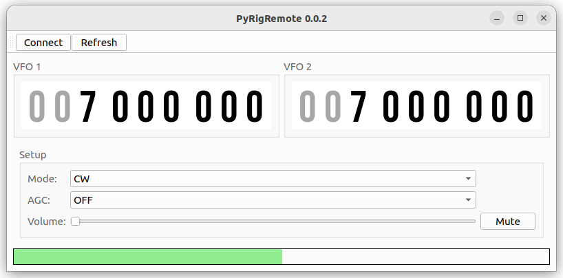

# PyRigRemote

A program to control radios via the serial port.

## Dependencies
* PySide6

### For development
* toml

## Installation
Test versions: https://test.pypi.org/project/pyrigremote/

Release versions: https://www.pypi.org/project/pyrigremote/

